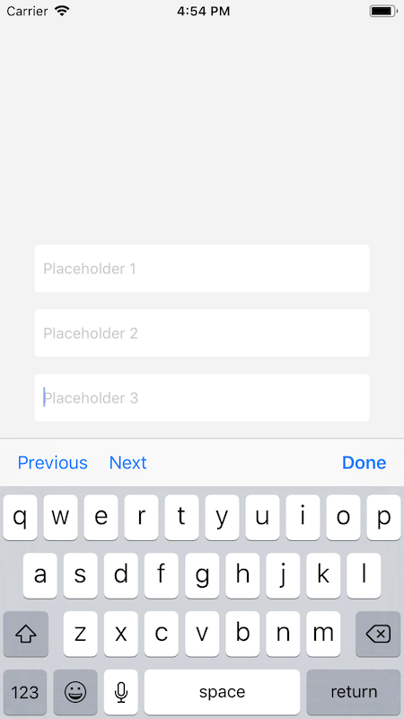

# Input keyboard observable
Handling text inputs `UITextField`, `UITextView` embedded in a `UIScrollView` when keyboard is presented.

## How to use
### Step 1
Adopt `InputKeyboardObservable` protocol in your custom text input.
```swift
class RoundedTextField: UITextField, InputKeyboardObservable {
   var textInputDidBeginEditingHandler: ((_ sender: UITextInput) -> Void)? { get set }
   // ...
}
```
### Step 2
Call `didBeginEditingHandler` to inform `InputKeyboardObservableViewController` when text input begins editing. This will scroll your text input just above the keyboard when you tap inside.
```swift
extension RoundedTextField: UITextFieldDelegate {
    func textFieldDidBeginEditing(_ textField: UITextField) {
        textInputDidBeginEditingHandler?(self)
    }
}
```
### Step 3
In your view controller containing the `UIScrollView` inherit from `InputKeyboardObservableViewController`.
```swift
class ViewController: InputKeyboardObservableViewController {
   // ...
}
```
Now, your view controller will handle text inputs automatically and you will also gain a keyboard toolbar containing `Previous`, `Next` and `Done` buttons for easier navigation.


